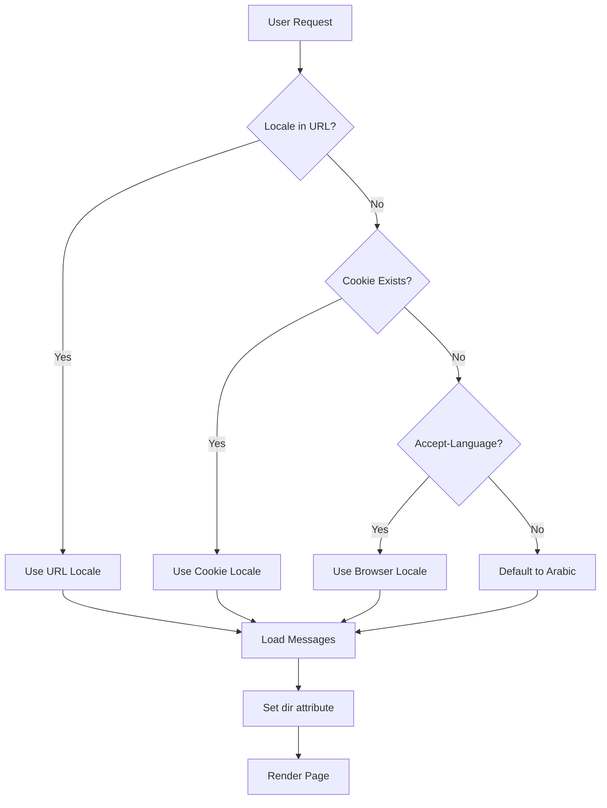

# Technical Design Document: Aman Ever Website

## Overview

The Aman Ever website is a multi-language, RTL-supported web application built with Next.js 15 App Router. The system provides a modern, accessible digital presence for "أمان إيفر" (Aman Ever), a leading Saudi technology platform specializing in technical and marketing mediation for medical, healthcare, and cosmetic services.

### About Aman Ever

Aman Ever is a pioneering Saudi technology platform that manages an integrated digital ecosystem and smart applications designed to keep pace with the digital health transformation in line with Saudi Vision 2030. The platform acts as a technical bridge connecting users with elite medical, health, and cosmetic service providers in the Kingdom.

**Core Services:**
- **Remote Medical Care**: Medical consultations and appointment scheduling
- **Home Services**: Healthcare services at the beneficiary's residence  
- **E-Commerce Store**: Integrated platform for purchasing medical products and services at discounted prices
- **Smart Financial Solutions**: Fixed offers and discounts, cashback program, and points wallet

**Vision:** To be the leading platform in medical marketing and digital healthcare in Saudi Arabia and the Arab region, actively contributing to achieving Saudi Vision 2030 targets.

**Mission:** To be a safe bridge connecting the community with medical and cosmetic services, facilitating easy and reliable access with the highest quality and technical standards.

**Core Values:**
- Clarity and Respect
- Simplified Innovation
- Safe Experience
- Service Partnership

### Core Technologies

- **Framework**: Next.js 15 with App Router and Turbopack
- **Language**: TypeScript for type safety
- **Styling**: Tailwind CSS with custom configuration
- **Component Library**: shadcn/ui (Radix UI primitives)
- **Internationalization**: next-intl for translations and locale routing
- **Animation**: Framer Motion for subtle UI animations
- **Icons**: lucide-react (outline style only)
- **Fonts**: IBM Plex Sans Arabic (Arabic/Urdu), Roboto (English)

### Key Design Principles

1. **Mobile-First**: Responsive design starting from 320px viewports
2. **Minimal Aesthetic**: Clean design with generous white space
3. **Subtle Animations**: Smooth transitions (200-400ms) with reduced-motion support
4. **Accessibility**: WCAG AA compliance, semantic HTML, keyboard navigation
5. **Performance**: Lighthouse score >90, optimized bundles, lazy loading
6. **Bidirectional Support**: Seamless RTL/LTR layout switching

## Architecture

### Project Structure

```
aman-ever-website/
├── app/
│   ├── [locale]/
│   │   ├── layout.tsx          # Root layout with locale provider
│   │   ├── page.tsx             # Home page with hero and services
│   │   ├── about/
│   │   │   └── page.tsx         # About Us page
│   │   ├── services/
│   │   │   └── page.tsx         # Services page
│   │   ├── vision/
│   │   │   └── page.tsx         # Vision and Mission page
│   │   └── values/
│   │       └── page.tsx         # Core Values page
│   ├── globals.css              # Global styles and Tailwind imports
│   ├── favicon.ico              # Favicon (generated from logo)
│   ├── apple-touch-icon.png     # iOS icon
│   └── manifest.json            # Web app manifest
├── components/
│   ├── ui/                      # shadcn/ui components
│   │   ├── button.tsx
│   │   ├── card.tsx
│   │   └── ...
│   ├── layout/
│   │   ├── header.tsx           # Navigation component
│   │   ├── footer.tsx
│   │   └── language-switcher.tsx
│   ├── home/
│   │   ├── hero-section.tsx     # Homepage hero with video
│   │   ├── hero-video.tsx       # YouTube video background component
│   │   └── services-section.tsx # Services showcase
│   └── shared/
│       ├── animated-card.tsx    # Reusable animated components
│       ├── service-card.tsx     # Service display card
│       └── logo.tsx
├── lib/
│   ├── utils.ts                 # Utility functions (cn, etc.)
│   ├── fonts.ts                 # Font configuration
│   └── constants.ts             # App constants (services data, etc.)
├── messages/
│   ├── ar.json                  # Arabic translations
│   ├── en.json                  # English translations
│   └── ur.json                  # Urdu translations
├── public/
│   ├── images/
│   │   ├── logo.png             # Main logo (transparent PNG)
│   │   ├── logo.jpeg            # Logo JPEG version
│   │   ├── services/
│   │   │   ├── telemedicine.jpg      # Placeholder: Unsplash/Pexels
│   │   │   ├── home-care.jpg         # Placeholder: Unsplash/Pexels
│   │   │   ├── ecommerce.jpg         # Placeholder: Unsplash/Pexels
│   │   │   └── financial.jpg         # Placeholder: Unsplash/Pexels
│   │   └── about/
│   │       ├── team.jpg              # Placeholder: Unsplash/Pexels
│   │       └── vision.jpg            # Placeholder: Unsplash/Pexels
│   └── icons/
│       ├── favicon-16x16.png
│       ├── favicon-32x32.png
│       ├── apple-touch-icon.png
│       ├── android-chrome-192x192.png
│       └── android-chrome-512x512.png
├── i18n.ts                      # next-intl configuration
├── middleware.ts                # Locale detection and routing
├── tailwind.config.ts           # Tailwind configuration
├── next.config.ts               # Next.js configuration
└── tsconfig.json
```

### Routing Architecture

The application uses Next.js App Router with locale-based routing:

- **Pattern**: `/[locale]/[...path]`
- **Examples**: 
  - `/ar` (Arabic home)
  - `/en` (English home)
  - `/ur` (Urdu home)
  - `/ar/about` (Arabic about page)

**Locale Detection Flow**:
1. Check URL path for explicit locale
2. Check cookie for saved preference
3. Check Accept-Language header
4. Default to Arabic (`ar`)

### Internationalization Flow



## Components and Interfaces

### Core Components

#### 1. Layout Components

**RootLayout** (`app/[locale]/layout.tsx`)
```typescript
interface RootLayoutProps {
  children: React.ReactNode;
  params: { locale: string };
}

// Responsibilities:
// - Set HTML lang and dir attributes
// - Load locale-specific fonts
// - Wrap children with NextIntlClientProvider
// - Apply global styles
```

**Header** (`components/layout/header.tsx`)
```typescript
interface HeaderProps {
  locale: string;
}

// Features:
// - Logo display (RTL/LTR aware positioning)
// - Navigation menu (responsive)
// - Language switcher
// - Mobile menu toggle
```

**LanguageSwitcher** (`components/layout/language-switcher.tsx`)
```typescript
interface LanguageSwitcherProps {
  currentLocale: string;
}

// Features:
// - Dropdown/button group for locale selection
// - Persist selection to cookie
// - Trigger page reload with new locale
// - Display language names in native script
```

#### 2. UI Components (shadcn/ui)

All shadcn/ui components will be customized to support:
- RTL layout mirroring
- Custom color palette (#5E8F8F primary)
- Consistent spacing and typography
- Accessibility features

**Key Components**:
- `Button`: Primary, secondary, outline variants
- `Card`: Content containers with optional animations
- `Input`: Form inputs with RTL text alignment
- `Select`: Dropdowns with RTL positioning
- `Dialog`: Modal overlays
- `Sheet`: Slide-out panels (direction-aware)

#### 3. Animation Components

**AnimatedCard** (`components/shared/animated-card.tsx`)
```typescript
interface AnimatedCardProps {
  children: React.ReactNode;
  delay?: number;
  className?: string;
}

// Animation Pattern:
// - Fade in from opacity 0 to 1
// - Slide up 20px
// - Duration: 300ms
// - Respects prefers-reduced-motion
```

**AnimatedSection** (`components/shared/animated-section.tsx`)
```typescript
interface AnimatedSectionProps {
  children: React.ReactNode;
  stagger?: boolean;
  staggerDelay?: number;
}

// Features:
// - Intersection Observer for viewport detection
// - Staggered children animations
// - Once-only animation (no repeat on scroll)
```

#### 4. Hero Components

**HeroSection** (`components/home/hero-section.tsx`)
```typescript
interface HeroSectionProps {
  locale: string;
}

// Features:
// - Full-width hero with video background
// - Overlay for text readability
// - Responsive typography
// - CTA buttons
// - Logo display
```

**HeroVideo** (`components/home/hero-video.tsx`)
```typescript
interface HeroVideoProps {
  videoUrl: string;  // YouTube video URL
  fallbackImage?: string;
}

// Features:
// - Embed YouTube video as background
// - Autoplay, muted, loop
// - Responsive iframe
// - Fallback to static image on error
// - Optimized for performance (lazy load)
```

### Component Hierarchy

```
RootLayout
├── Header
│   ├── Logo
│   ├── Navigation
│   └── LanguageSwitcher
├── Page Content
│   ├── HeroSection (Home page only)
│   │   ├── HeroVideo
│   │   ├── Logo
│   │   └── CTAButtons
│   ├── AnimatedSection
│   │   └── AnimatedCard[]
│   └── ...
└── Footer
```

### Interface Definitions

**Locale Configuration**
```typescript
type Locale = 'ar' | 'en' | 'ur';

interface LocaleConfig {
  code: Locale;
  name: string;
  nativeName: string;
  dir: 'rtl' | 'ltr';
  font: string;
}

const locales: Record<Locale, LocaleConfig> = {
  ar: {
    code: 'ar',
    name: 'Arabic',
    nativeName: 'العربية',
    dir: 'rtl',
    font: 'IBM Plex Sans Arabic'
  },
  en: {
    code: 'en',
    name: 'English',
    nativeName: 'English',
    dir: 'ltr',
    font: 'Roboto'
  },
  ur: {
    code: 'ur',
    name: 'Urdu',
    nativeName: 'اردو',
    dir: 'rtl',
    font: 'IBM Plex Sans Arabic'
  }
};
```

**Translation Messages**
```typescript
interface Messages {
  common: {
    siteName: string;
    home: string;
    about: string;
    services: string;
    vision: string;
    values: string;
    contact: string;
    // ...
  };
  home: {
    hero: {
      title: string;           // "شريككم الذكي في رحلة الرعاية الطبية"
      subtitle: string;
      cta: string;
    };
    services: {
      title: string;
      remoteCare: {
        title: string;
        description: string;
      };
      homeServices: {
        title: string;
        description: string;
      };
      ecommerce: {
        title: string;
        description: string;
      };
      financial: {
        title: string;
        description: string;
      };
    };
  };
  about: {
    title: string;
    intro: string;
    mission: string;
    vision: string;
  };
  values: {
    title: string;
    clarity: {
      title: string;
      description: string;
    };
    innovation: {
      title: string;
      description: string;
    };
    safety: {
      title: string;
      description: string;
    };
    partnership: {
      title: string;
      description: string;
    };
  };
  // ... other namespaces
}
```

## Data Models

### Content Data Models

**Services Data** (`lib/constants.ts`)
```typescript
export interface Service {
  id: string;
  icon: string;              // lucide-react icon name
  titleKey: string;          // Translation key
  descriptionKey: string;    // Translation key
  href: string;              // Link to service page
}

export const services: Service[] = [
  {
    id: 'remote-care',
    icon: 'Video',
    titleKey: 'home.services.remoteCare.title',
    descriptionKey: 'home.services.remoteCare.description',
    href: '/services#remote-care'
  },
  {
    id: 'home-services',
    icon: 'Home',
    titleKey: 'home.services.homeServices.title',
    descriptionKey: 'home.services.homeServices.description',
    href: '/services#home-services'
  },
  {
    id: 'ecommerce',
    icon: 'ShoppingCart',
    titleKey: 'home.services.ecommerce.title',
    descriptionKey: 'home.services.ecommerce.description',
    href: '/services#ecommerce'
  },
  {
    id: 'financial',
    icon: 'Wallet',
    titleKey: 'home.services.financial.title',
    descriptionKey: 'home.services.financial.description',
    href: '/services#financial'
  }
];
```

**Core Values Data** (`lib/constants.ts`)
```typescript
export interface CoreValue {
  id: string;
  icon: string;
  titleKey: string;
  descriptionKey: string;
}

export const coreValues: CoreValue[] = [
  {
    id: 'clarity',
    icon: 'Eye',
    titleKey: 'values.clarity.title',
    descriptionKey: 'values.clarity.description'
  },
  {
    id: 'innovation',
    icon: 'Lightbulb',
    titleKey: 'values.innovation.title',
    descriptionKey: 'values.innovation.description'
  },
  {
    id: 'safety',
    icon: 'Shield',
    titleKey: 'values.safety.title',
    descriptionKey: 'values.safety.description'
  },
  {
    id: 'partnership',
    icon: 'Handshake',
    titleKey: 'values.partnership.title',
    descriptionKey: 'values.partnership.description'
  }
];
```

### Configuration Models

**next-intl Configuration** (`i18n.ts`)
```typescript
export default getRequestConfig(async ({ locale }) => ({
  messages: (await import(`./messages/${locale}.json`)).default
}));
```

**Middleware Configuration** (`middleware.ts`)
```typescript
import createMiddleware from 'next-intl/middleware';

export default createMiddleware({
  locales: ['ar', 'en', 'ur'],
  defaultLocale: 'ar',
  localePrefix: 'always'
});

export const config = {
  matcher: ['/((?!api|_next|_vercel|.*\\..*).*)']
};
```

**Font Configuration** (`lib/fonts.ts`)
```typescript
import { IBM_Plex_Sans_Arabic, Roboto } from 'next/font/google';

export const ibmPlexArabic = IBM_Plex_Sans_Arabic({
  subsets: ['arabic'],
  weight: ['300', '400', '500', '600', '700'],
  variable: '--font-arabic',
  display: 'swap'
});

export const roboto = Roboto({
  subsets: ['latin'],
  weight: ['300', '400', '500', '700'],
  variable: '--font-latin',
  display: 'swap'
});
```

**Tailwind Configuration** (`tailwind.config.ts`)
```typescript
import type { Config } from 'tailwindcss';

const config: Config = {
  content: [
    './pages/**/*.{js,ts,jsx,tsx,mdx}',
    './components/**/*.{js,ts,jsx,tsx,mdx}',
    './app/**/*.{js,ts,jsx,tsx,mdx}',
  ],
  theme: {
    extend: {
      colors: {
        primary: {
          50: '#f0f7f7',
          100: '#d9ebeb',
          200: '#b7d9d9',
          300: '#8bc0c0',
          400: '#5e8f8f',  // Main brand color
          500: '#4a7373',
          600: '#3d5f5f',
          700: '#344f4f',
          800: '#2d4242',
          900: '#283838',
          950: '#141f1f',
        },
        neutral: {
          50: '#fafafa',
          100: '#f5f5f5',
          200: '#e5e5e5',
          300: '#d4d4d4',
          400: '#a3a3a3',
          500: '#737373',
          600: '#525252',
          700: '#404040',
          800: '#262626',
          900: '#171717',
          950: '#0a0a0a',
        },
      },
      fontFamily: {
        arabic: ['var(--font-arabic)'],
        latin: ['var(--font-latin)'],
      },
      fontSize: {
        'xs': '12px',
        'sm': '14px',
        'base': '16px',
        'lg': '18px',
        'xl': '20px',
        '2xl': '24px',
        '3xl': '30px',
      },
      lineHeight: {
        'arabic': '1.65',
        'latin': '1.5',
      },
      spacing: {
        // Consistent spacing scale
      },
    },
  },
  plugins: [
    require('tailwindcss-rtl'),
  ],
};

export default config;
```

### State Management

The application uses minimal client-side state:

1. **Locale State**: Managed by next-intl via URL and cookies
2. **UI State**: Local component state (React useState)
3. **Animation State**: Managed by Framer Motion
4. **Form State**: Local state or form libraries (if needed)

No global state management library (Redux, Zustand) is required for this application.

## Error Handling

### Error Boundaries

**Global Error Boundary** (`app/[locale]/error.tsx`)
```typescript
'use client';

export default function Error({
  error,
  reset,
}: {
  error: Error & { digest?: string };
  reset: () => void;
}) {
  return (
    <div className="flex min-h-screen items-center justify-center">
      <div className="text-center">
        <h2>{/* Localized error message */}</h2>
        <button onClick={reset}>{/* Localized retry button */}</button>
      </div>
    </div>
  );
}
```

**Not Found Handler** (`app/[locale]/not-found.tsx`)
```typescript
export default function NotFound() {
  return (
    <div className="flex min-h-screen items-center justify-center">
      <div className="text-center">
        <h1>404</h1>
        <p>{/* Localized not found message */}</p>
        <Link href="/">{/* Localized home link */}</Link>
      </div>
    </div>
  );
}
```

### Error Handling Strategies

1. **Locale Loading Errors**
   - Fallback to default locale (Arabic)
   - Log error to console in development
   - Display user-friendly message

2. **Image Loading Errors**
   - Use Next.js Image placeholder
   - Fallback to alt text
   - Optional: Display placeholder icon

3. **Font Loading Errors**
   - System font fallbacks defined in font configuration
   - No layout shift with `font-display: swap`

4. **Animation Errors**
   - Graceful degradation if Framer Motion fails
   - Content remains accessible without animations

5. **Network Errors**
   - Retry mechanism for failed requests
   - User-friendly error messages
   - Offline detection (if needed)

### Validation

**Locale Validation**
```typescript
function isValidLocale(locale: string): locale is Locale {
  return ['ar', 'en', 'ur'].includes(locale);
}

// Used in middleware and layout
```

**Form Validation** (if forms are added)
- Client-side validation with HTML5 attributes
- Server-side validation for security
- Localized error messages
- Accessible error announcements

## Testing Strategy

### Testing Approach

This is a UI-focused website project with internationalization and responsive design requirements. **Property-based testing is NOT applicable** for this feature because:

1. **UI Rendering**: Testing visual layouts, RTL/LTR switching, and responsive behavior requires snapshot tests and visual regression testing, not property-based tests
2. **Internationalization**: Translation loading and locale switching are configuration-based, best tested with example-based tests
3. **Component Behavior**: User interactions and animations are specific scenarios, not universal properties
4. **No Complex Algorithms**: The application doesn't contain parsers, serializers, or data transformations that benefit from property-based testing

Instead, we will use:
- **Unit Tests**: Component behavior and utility functions
- **Integration Tests**: Locale switching, routing, and i18n flow
- **Visual Tests**: Snapshot testing for UI consistency
- **E2E Tests**: Critical user journeys
- **Accessibility Tests**: Automated a11y checks

### Testing Stack

- **Framework**: Vitest (fast, TypeScript-native)
- **React Testing**: React Testing Library
- **E2E**: Playwright
- **Accessibility**: axe-core / jest-axe
- **Visual**: Playwright snapshots or Percy

### Unit Tests

**Component Tests**
```typescript
// components/layout/language-switcher.test.tsx
describe('LanguageSwitcher', () => {
  it('displays all available locales', () => {
    // Test that ar, en, ur are shown
  });

  it('highlights current locale', () => {
    // Test active state styling
  });

  it('switches locale on click', () => {
    // Test locale change triggers navigation
  });

  it('persists locale to cookie', () => {
    // Test cookie is set correctly
  });
});
```

**Utility Tests**
```typescript
// lib/utils.test.ts
describe('cn utility', () => {
  it('merges class names correctly', () => {
    // Test Tailwind class merging
  });
});

describe('isValidLocale', () => {
  it('returns true for valid locales', () => {
    expect(isValidLocale('ar')).toBe(true);
    expect(isValidLocale('en')).toBe(true);
    expect(isValidLocale('ur')).toBe(true);
  });

  it('returns false for invalid locales', () => {
    expect(isValidLocale('fr')).toBe(false);
    expect(isValidLocale('invalid')).toBe(false);
  });
});
```

### Integration Tests

**Locale Routing Tests**
```typescript
describe('Locale Routing', () => {
  it('defaults to Arabic when no locale specified', async () => {
    // Test middleware redirects to /ar
  });

  it('respects explicit locale in URL', async () => {
    // Test /en loads English content
  });

  it('loads correct translations for each locale', async () => {
    // Test messages are loaded correctly
  });
});
```

**RTL/LTR Tests**
```typescript
describe('Bidirectional Layout', () => {
  it('applies dir="rtl" for Arabic', () => {
    // Test HTML dir attribute
  });

  it('applies dir="ltr" for English', () => {
    // Test HTML dir attribute
  });

  it('mirrors directional icons in RTL', () => {
    // Test icon transformation
  });

  it('applies correct text alignment', () => {
    // Test text-right for RTL, text-left for LTR
  });
});
```

### Visual Regression Tests

**Snapshot Tests**
```typescript
describe('Visual Snapshots', () => {
  it('matches header snapshot in Arabic', async () => {
    // Playwright screenshot comparison
  });

  it('matches header snapshot in English', async () => {
    // Playwright screenshot comparison
  });

  it('matches mobile menu snapshot', async () => {
    // Test responsive menu
  });
});
```

### E2E Tests

**Critical User Journeys**
```typescript
describe('Language Switching Journey', () => {
  it('allows user to switch from Arabic to English', async () => {
    // 1. Load site (defaults to Arabic)
    // 2. Click language switcher
    // 3. Select English
    // 4. Verify content is in English
    // 5. Verify URL is /en
    // 6. Verify cookie is set
  });

  it('persists language preference across sessions', async () => {
    // 1. Set language to English
    // 2. Close browser
    // 3. Reopen site
    // 4. Verify still in English
  });
});

describe('Responsive Navigation', () => {
  it('shows mobile menu on small screens', async () => {
    // Test mobile menu toggle
  });

  it('shows desktop menu on large screens', async () => {
    // Test desktop navigation
  });
});
```

### Accessibility Tests

**Automated A11y Checks**
```typescript
describe('Accessibility', () => {
  it('has no axe violations on home page', async () => {
    // Run axe-core on each locale
  });

  it('supports keyboard navigation', async () => {
    // Test tab order and focus management
  });

  it('has proper ARIA labels', async () => {
    // Test language switcher, navigation, etc.
  });

  it('provides skip-to-content link', async () => {
    // Test skip link functionality
  });
});
```

### Performance Tests

**Lighthouse CI**
```typescript
describe('Performance', () => {
  it('achieves Lighthouse score >90', async () => {
    // Run Lighthouse in CI
  });

  it('loads fonts without layout shift', async () => {
    // Test CLS metric
  });

  it('lazy loads images below fold', async () => {
    // Test image loading strategy
  });
});
```

### Animation Tests

**Reduced Motion Tests**
```typescript
describe('Animations', () => {
  it('respects prefers-reduced-motion', async () => {
    // Set media query
    // Verify animations are disabled
  });

  it('applies hover animations on interactive elements', async () => {
    // Test scale transformation
  });

  it('staggers card entrance animations', async () => {
    // Test animation timing
  });
});
```

### Test Coverage Goals

- **Unit Tests**: >80% coverage for utilities and components
- **Integration Tests**: All locale switching and routing scenarios
- **E2E Tests**: All critical user journeys
- **Accessibility Tests**: 100% of pages tested with axe-core
- **Visual Tests**: Key components and layouts in all locales

### Testing Best Practices

1. **Test Behavior, Not Implementation**: Focus on user-facing behavior
2. **Localized Test Data**: Use actual translations in tests
3. **Responsive Testing**: Test at multiple viewport sizes
4. **Accessibility First**: Include a11y checks in all test suites
5. **Fast Feedback**: Unit tests run on every commit
6. **CI/CD Integration**: E2E and visual tests run on PRs
7. **Test Isolation**: Each test is independent and can run in parallel

### Manual Testing Checklist

- [ ] Visual QA in all three locales (ar, en, ur)
- [ ] Test on real devices (iOS, Android)
- [ ] Test with screen readers (NVDA, VoiceOver)
- [ ] Test with keyboard only (no mouse)
- [ ] Test on slow network connections
- [ ] Test with browser extensions disabled
- [ ] Cross-browser testing (Chrome, Firefox, Safari, Edge)

---

## Implementation Notes

### Development Workflow

1. **Setup**: Initialize Next.js project with TypeScript and Turbopack
2. **Configuration**: Set up Tailwind, next-intl, fonts, and shadcn/ui
3. **Layout**: Build root layout with locale provider and font loading
4. **Components**: Implement UI components with RTL support
5. **Pages**: Create page components with translations
6. **Animations**: Add Framer Motion animations
7. **Testing**: Write tests alongside implementation
8. **Optimization**: Optimize images, fonts, and bundles
9. **Accessibility**: Audit and fix a11y issues
10. **Deployment**: Deploy to Vercel or similar platform

### Key Implementation Patterns

**Hero Video Background Pattern**
```tsx
// components/home/hero-video.tsx
'use client';

export function HeroVideo({ videoUrl }: { videoUrl: string }) {
  // Extract YouTube video ID
  const videoId = videoUrl.split('v=')[1]?.split('&')[0];
  
  return (
    <div className="absolute inset-0 w-full h-full overflow-hidden">
      <iframe
        src={`https://www.youtube.com/embed/${videoId}?autoplay=1&mute=1&loop=1&playlist=${videoId}&controls=0&showinfo=0&rel=0&modestbranding=1`}
        className="absolute top-1/2 left-1/2 w-[300%] h-[300%] -translate-x-1/2 -translate-y-1/2"
        allow="autoplay; encrypted-media"
        loading="lazy"
      />
      {/* Dark overlay for text readability */}
      <div className="absolute inset-0 bg-black/40" />
    </div>
  );
}
```

**RTL-Aware Styling**
```tsx
// Use Tailwind logical properties
<div className="ms-4 me-2"> {/* margin-inline-start, margin-inline-end */}
  {/* Automatically flips in RTL */}
</div>

// Conditional classes based on direction
<div className={cn(
  "flex items-center",
  dir === 'rtl' ? 'flex-row-reverse' : 'flex-row'
)}>
  {/* ... */}
</div>
```

**Font Loading Pattern**
```tsx
// app/[locale]/layout.tsx
import { ibmPlexArabic, roboto } from '@/lib/fonts';

export default function RootLayout({ children, params }: Props) {
  const { locale } = params;
  const isRTL = locale === 'ar' || locale === 'ur';
  const fontClass = isRTL ? ibmPlexArabic.variable : roboto.variable;

  return (
    <html lang={locale} dir={isRTL ? 'rtl' : 'ltr'} className={fontClass}>
      <body className={isRTL ? 'font-arabic' : 'font-latin'}>
        {children}
      </body>
    </html>
  );
}
```

**Animation Pattern**
```tsx
// components/shared/animated-card.tsx
'use client';

import { motion } from 'framer-motion';

export function AnimatedCard({ children, delay = 0 }: Props) {
  return (
    <motion.div
      initial={{ opacity: 0, y: 20 }}
      whileInView={{ opacity: 1, y: 0 }}
      viewport={{ once: true, margin: '-100px' }}
      transition={{ duration: 0.3, delay }}
    >
      {children}
    </motion.div>
  );
}
```

**Translation Usage Pattern**
```tsx
// app/[locale]/page.tsx
import { useTranslations } from 'next-intl';

export default function HomePage() {
  const t = useTranslations('home');

  return (
    <div>
      <h1>{t('hero.title')}</h1>
      <p>{t('hero.subtitle')}</p>
    </div>
  );
}
```

### Performance Optimization Strategies

1. **Code Splitting**: Automatic with App Router
2. **Image Optimization**: Use Next.js Image component with proper sizing
3. **Font Optimization**: Subset fonts, use font-display: swap
4. **Bundle Analysis**: Use @next/bundle-analyzer
5. **Lazy Loading**: Dynamic imports for heavy components
6. **Caching**: Leverage Next.js caching strategies
7. **Compression**: Enable gzip/brotli on server
8. **CDN**: Serve static assets from CDN

### Accessibility Checklist

- [x] Semantic HTML structure
- [x] Proper heading hierarchy
- [x] Alt text for images
- [x] ARIA labels for interactive elements
- [x] Keyboard navigation support
- [x] Focus indicators
- [x] Skip-to-content link
- [x] Color contrast (WCAG AA)
- [x] Reduced motion support
- [x] Screen reader testing

---

This design document provides a comprehensive technical foundation for implementing the Aman Ever website. The architecture supports all requirements while maintaining flexibility for future enhancements.
